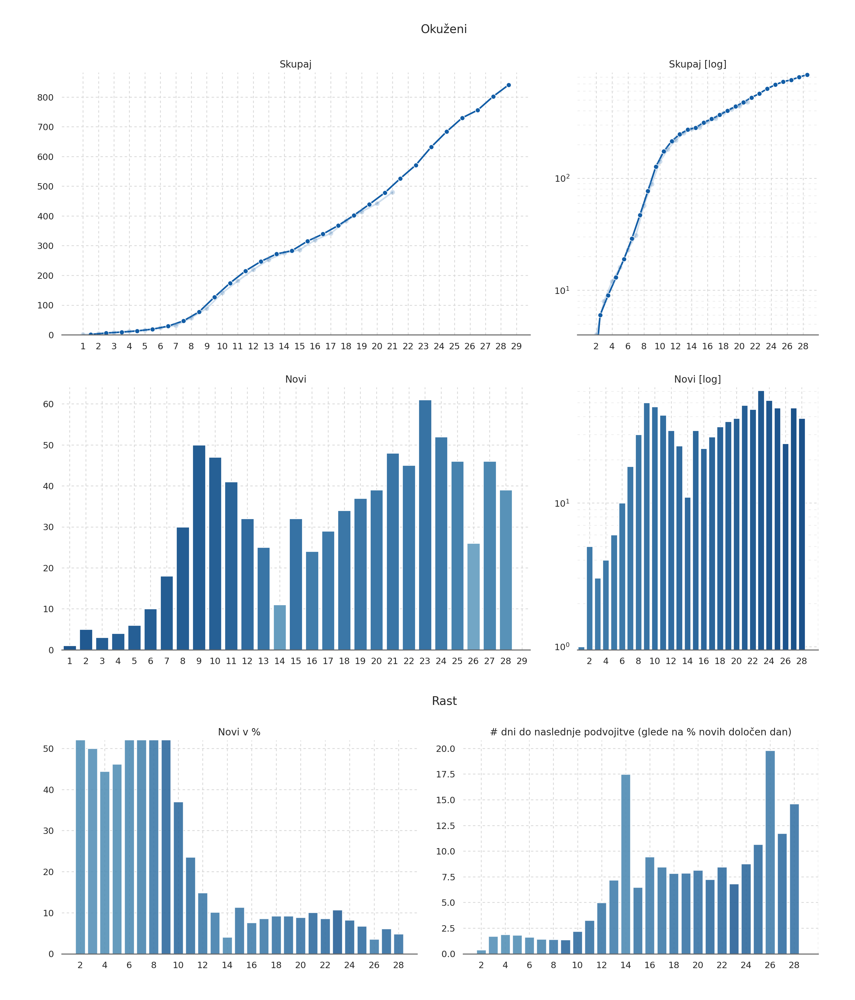
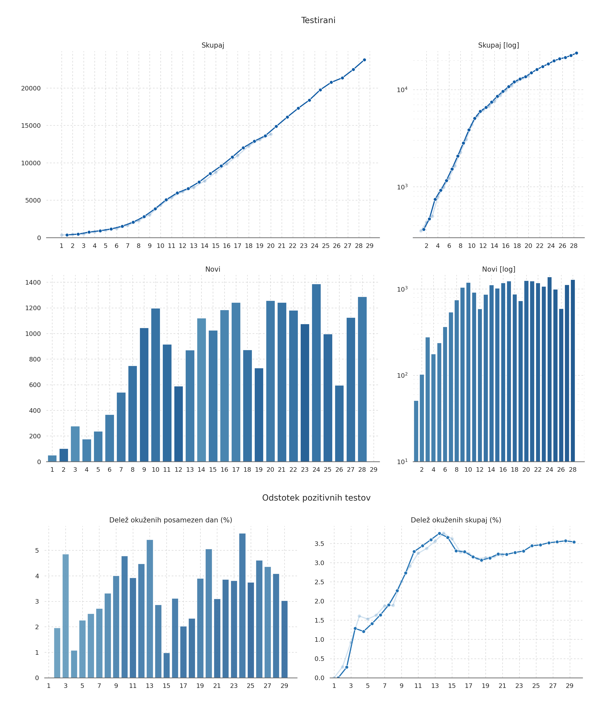
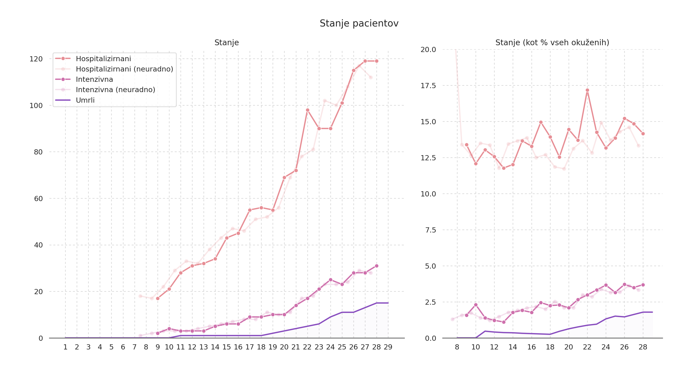
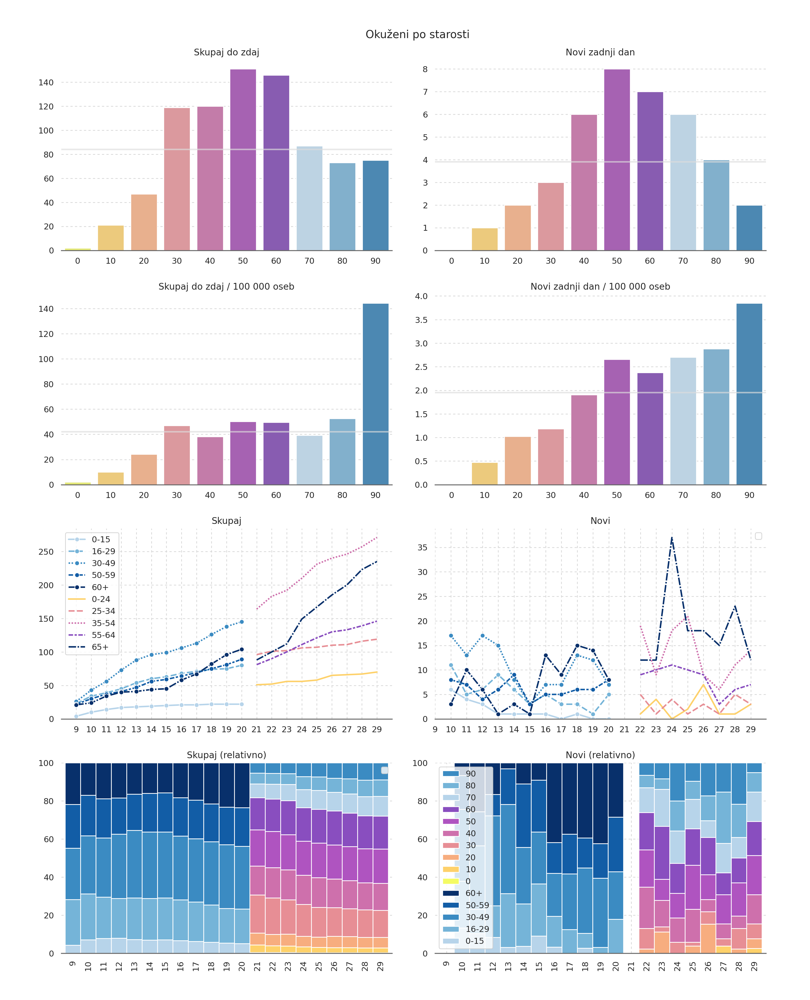
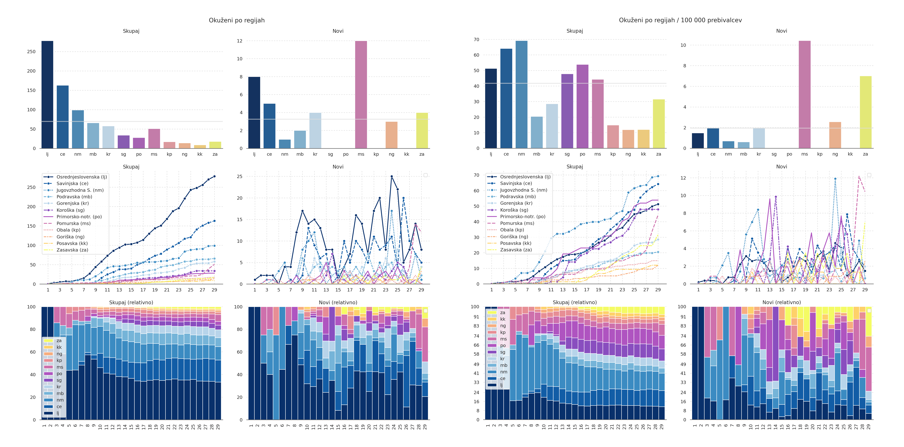
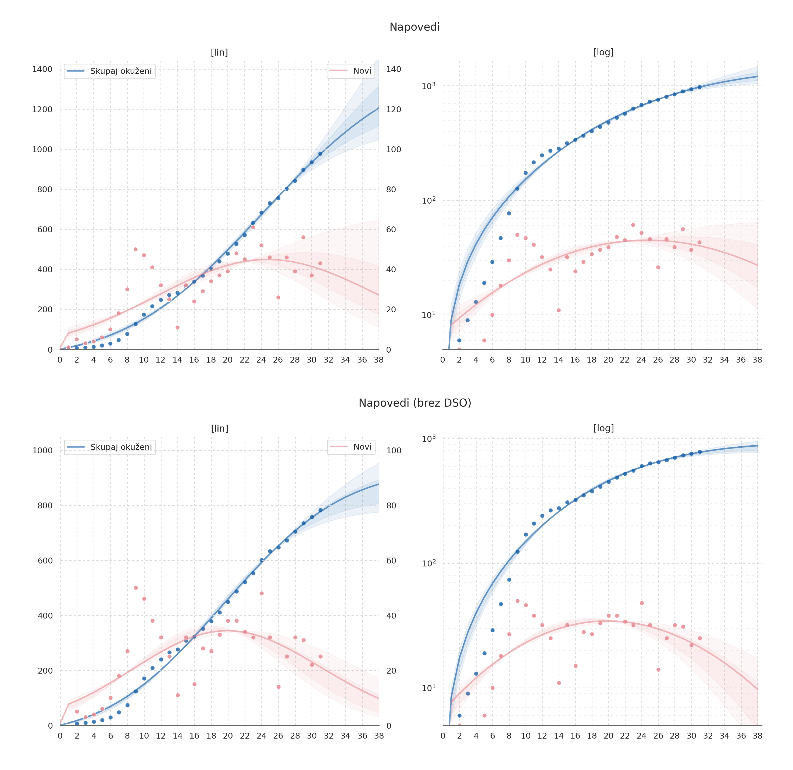

# Covid data visualization and analysis for Slovenia

This was my personal project for visualizing and analyzing COVID-19 data for Slovenia during the first wave of the pandemic in spring 2020. I started it on 13. march (beginning of the first lockdown), and kept updating and improving it until april, when [Sledilnik](https://covid-19.sledilnik.org/sl/stats ) became good enough to replace most of it.

Raw data (number of cases and tests) was gathered from various sources, then combined, cleaned and analysed in Python. The visualizations were done in Python inside Jupyter Notebook using `pandas`, `matplotlib` and `seaborn`. Predictions were calculated using [SIR-X model](http://rocs.hu-berlin.de/corona/docs/forecast/model/). At first I was exporting the results as a pdf of the entire notebook, but later switched to exporting just the images.

Below you can see example visualizations for 1. april. Final analysis for the last day changes were made (4. april 2020) is in the [Korona.ipynb](Korona.ipynb) notebook, and the corresponding images are in the [images](images) folder. Check out the [archive](archive) folder for earlier data. *Note that everything is in Slovenian*.

### Sources of the data (some may not work anymore):

1. NIJZ: *[Spremljanje koronavirusa SARS-CoV-2 (COVID-19)](https://www.nijz.si/sl/pojav-novega-koronavirusa-2019-ncov)*
2. NIJZ: *[Dnevno spremljanje okužb s SARS-CoV-2 (COVID-19) [graph]](https://www.nijz.si/sl/dnevno-spremljanje-okuzb-s-sars-cov-2-covid-19)*
3. Data published by the government on *[gov.si](https://www.gov.si/teme/koronavirus/)* and *[twitter](https://twitter.com/vladaRS)*.
4. Luka Renko and others: *[COVID-19 Slovenija](https://slo-covid-19.rtfm.si/#/about)*

## Graphs for 4. april

### Cases

Cumulative & daily new cases (linear and log scale), growth analysis (new cases as percentage of all, doubling time)

### Tests

Cumulative & daily new (linear and log scale), daily and overall positive percentage

### Hospitalized

Hospitilized patients, ICU patiens and cumulative deaths, both absolute and as a percentage of cumulative infections

### Cases by age

Cumulative and daily new cases by age group (total and per 100k population), both absolute and relative

### Cases by region

Cumulative and daily new cases by region (total and per 100k population), both absolute and relative

### Predictions (4. april)

Predictions for the next week using [SIR-X model](http://rocs.hu-berlin.de/corona/docs/forecast/model/)

